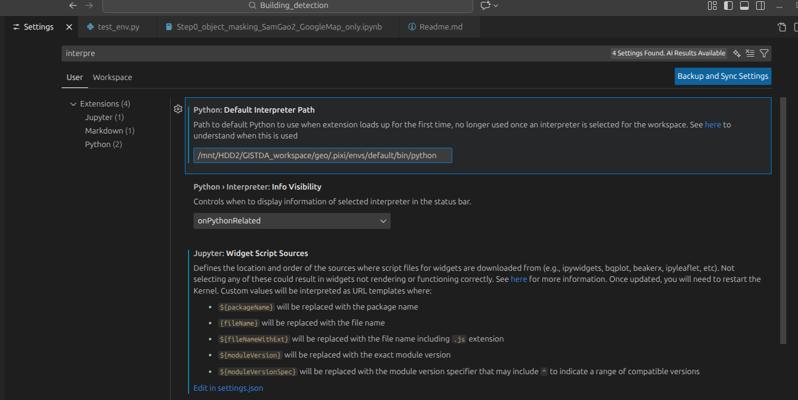
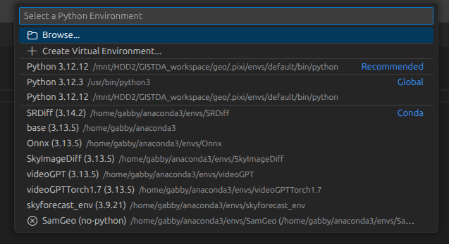

## Installation

1. Install pixi in the user directory

```
user@~$ curl -fsSL https://pixi.sh/install.sh | sh
```
or
```
powershell -ExecutionPolicy Bypass -c "irm -useb https://pixi.sh/install.ps1 | iex"
```

2. Go to the working directory and set the pixi environment.

```
user@~$ cd workspace$
user@~/workspace$ pixi init geo
user@~/workspace$ cd geo
```

3. Intialize the pixi environment. 

```
user@~/workspace/geo$ pixi install 
```

4. Clone the github repo inside the pixi environment: `geo`.

```
user@~/workspace/geo$ git clone https://github.com/GenAI-CUEE/GeoAnnotation.git
```

5. Open the cloned github folder in VSCode. Then, set the default python interpreter to the pixi environment.

- Clt+Shift+P. Under `Default interpreter path`, provide the python path from pixi




6. Activate the pixi environment for python script and jupyter notebook kernel. 



7. You may have to install additional packages under `geo`

```
user@~/workspace$ cd geo
user@~/workspace/geo$ pixi add segment-geospatial[samgeo2] --pypi
user@~/workspace/geo$ pixi add sam2 --pipy
user@~/workspace/geo$ pixi add fiona --pypi
```
 