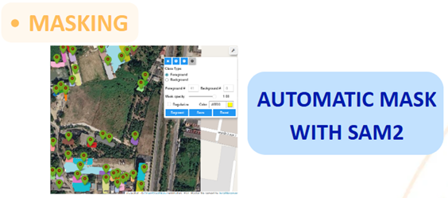
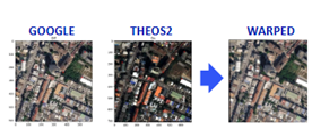
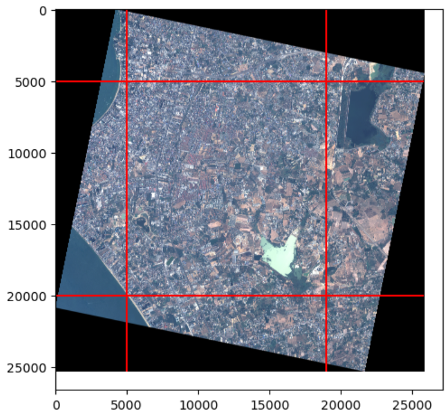
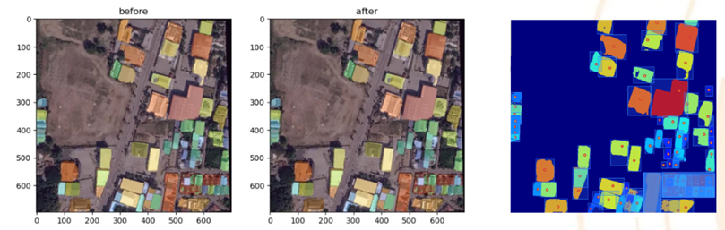
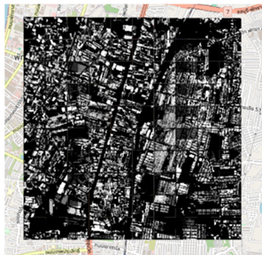
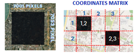
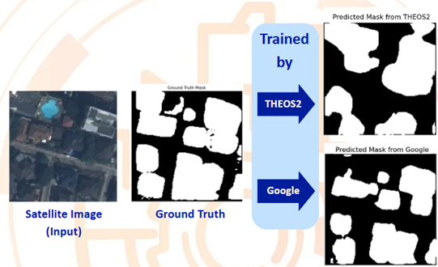

## Installation

Installing packages and set up environment: [Installation.md](Installation.md) 

## Quick start

### Data annotation.
We will go over the following topics for data annotation (ground truth annotation): 
- [Tutorial 1 image enhancement](Tutorial_1_image_enhancement.ipynb) for how to read, write, and enhance a satellite image in GeoTiff format;


- [Tutorial 2 mask detection SamGao2](Tutorial_2_mask_detection_SamGao2.ipynb) for how to extract detection mask with prompts, extract the bounding boxes, enhance the masks, and save it back to GeoTiff format; 



- [Tutorial 3 interactive warping](Tutorial_3_interactive_warping.ipynb) for how to extract homography between image pairs providing the correspondence points and apply the homography to warp Google map and the detection mask from previous tutorial. Then, we will extract the masks from the warped Google map.  



- [Tutorial 4 cliping satellite](Tutorial_4_cliping_satellite.ipynb) for showing how the area from a large satellite image is selected.



- [Tutorial 5 slicing a map to grids and annotate the mask](Tutorial_5_slicing_map_and_using_samgeo_to_annotate.ipynb) for showing how the selected area is divided and perform data annotation using samgeo2.



- [Tutorial 6 slicing a map to grids and merge them back into a map](Tutorial_6_slicing_and_merge_map.ipynb) for showing how to further slice the data (if needed), and how to merge the annotated data back to a large map.  



### Training a new model to mask the building.

We will go over the following topics for data processing and training a new deep learning model: 
- [Tutorial 7 merge the slice and preprocessing them for DL task](Tutorial_7_merge_sliced_pics_and_preprocessing.ipynb) for showing how the previous results are merged into a map and dividing them into smaller pieces for training a deep learning model. 



- [Tutorial 8 train a deep learning model](Tutorial_8_train_model.ipynb) for training a deep learning model. 





## Poster


### Folder organization

```
DL_modules/
    -> models.py  
    # contains a DL-model that is U-Net for making the binary mask
DL_utils/
    -> dataset.py 
    # contains data preprocessing for training a model.
    -> utils.py   
    # contains early stopper used in finding the most appropriate epoch
utils/
    -> interactive_tools.py 
    # contains tool for annotating points for finding correspondences. 
    -> mask_tools.py 
    # Read and process the building mask (in GeoTiff format); should contain important tools for processing binary mask.
    -> raster_tools.py 
    # Read and process Satellite images (in GeoTiff format); should contain important tools for processing satellite images.
    -> tools.py 
    # Read and process any GeoTiff file.
```

Data folder
``` 
Total/ # รวบรวมผลของการทำ segmentation ของทุกคน ด้วยกัน
raw_data/ # รวบรวมผลของการนำ folder Total/ remove file ที่ไม่ได้ใช้ต่ออก เช่น พวก top left top right ออก
Sorted_Data/ # รวบรวมผลของการดึง เฉพาะ mask กับ ภาพ แล้วเปลี่ยนชื่อ
Result/  # รวบรวมผลของการ partition ให้เป็น 16x16
```


## Contributors

1. Phoomipas Chobchuphol
2. Chitpisit Pichayakitisin
3. Kan Namprohm
4. Nonthapat Mahapromrak
5. Thanut Vachirabenjapong

